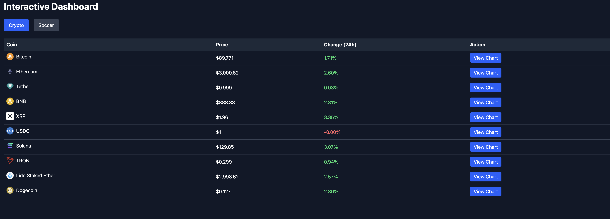

# CoinKick

CoinKick is an interactive frontend dashboard for crypto and soccer, featuring real-time charts and dynamic data visualization. Built with React, Vue, TailwindCSS, and Chart.js, CoinKick lets you track crypto trends and live soccer stats in one sleek interface.

## Features

- Real-time crypto prices and market trends
- Live soccer match scores and stats
- Interactive charts for data visualization
- Responsive and mobile-friendly design
- Multi-framework approach: React + Vue

## Tech Stack

- Frontend: React, Vue
- Styling: TailwindCSS
- Charts: Chart.js, react-chartjs-2
- Data fetching: Axios (REST APIs / WebSockets for real-time)
- Build & Dev: Vite
- Code Quality: ESLint

## Screenshot


## Getting Started

1. Clone the repository:
```bash
git clone https://github.com/yourusername/coinkick.git
cd coinkick
```

2. Install dependencies:

```bash
bun install
```

3. Start the development server:
```bash
bun run dev
```

4. Open the app in your browser (usually at http://localhost:5173)
