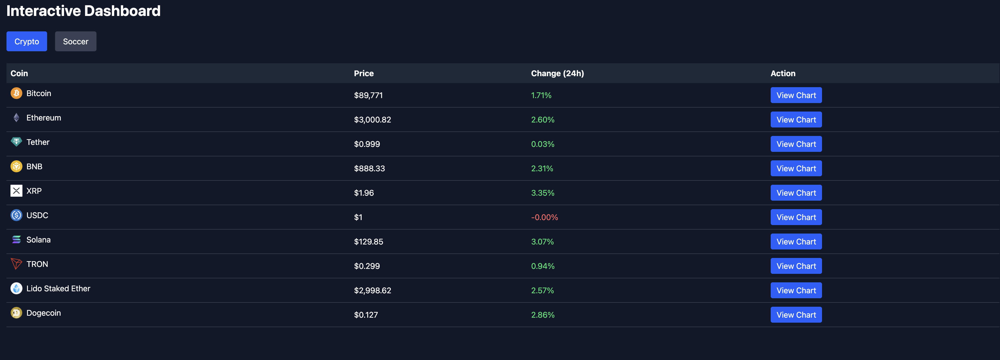

# LivePulse Dashboard

A real-time dashboard for tracking crypto market data and live soccer match scores in one unified interface.

Built with modern frontend tooling and real-time data patterns, this project demonstrates live updates, data visualization, and reactive UI design.

## Overview

LivePulse Dashboard provides two live data experiences:

### Crypto Market
- Real-time cryptocurrency prices
- Market trends and percentage changes
- Interactive charts for price movement

### Live Soccer Scores
- Live match updates
- Team statistics and game state
- Real-time score tracking

The goal is to simulate a real-time multi-domain data dashboard using modern web technologies.

## Features

- ⚡Real-time updates (REST + WebSockets)
- Interactive charts and visual analytics
- Live data synchronization
- Responsive UI design
- Modular component architecture
- Fast build and development workflow

## Tech Stack

- Frontend: React
- Styling: TailwindCSS
- Charts: Chart.js, react-chartjs-2
- Data fetching: Axios (REST APIs / WebSockets for real-time)
- Build & Dev: Vite
- Code Quality: ESLint

## Screenshot


## Getting Started

1. Clone the repository:
```bash
git clone https://github.com/yourusername/coinkick.git
cd coinkick
```

2. Install dependencies:

```bash
bun install
```

3. Start the development server:
```bash
bun run dev
```

4. Open the app in your browser (usually at http://localhost:5173)
